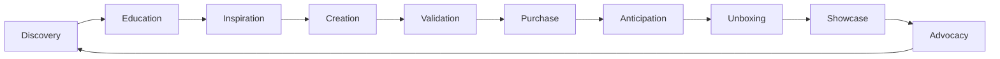
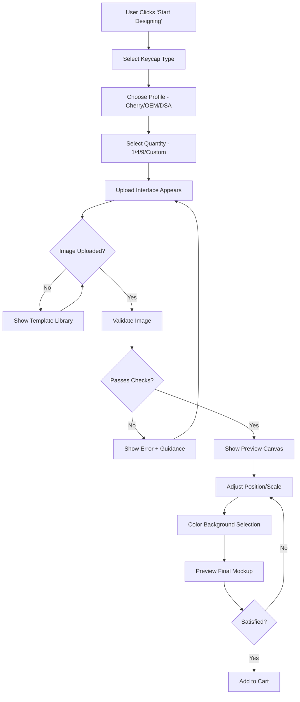
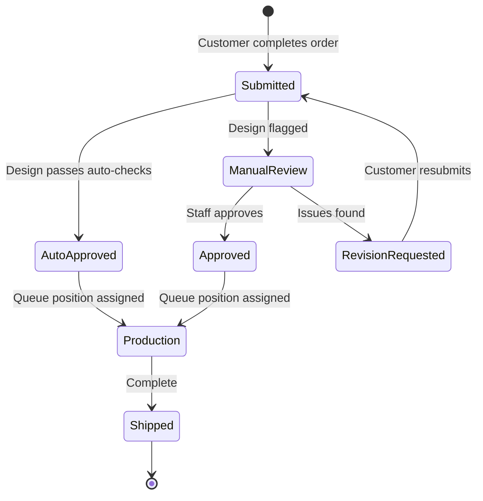
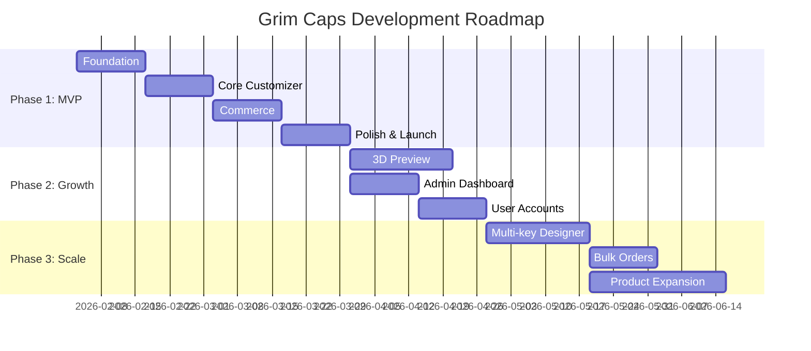

# Grim Caps: Strategic Analysis & Technical Architecture

> **Prepared by:** Startup Advisory Analysis  
> **Date:** February 3, 2026  
> **Scope:** Business model validation, customer journey optimization, website architecture, and technical roadmap for a custom mechanical keyboard keycap startup using dye sublimation.

---

## Executive Summary

Grim Caps has strong fundamentals—a passionate niche market, scalable personalization tech, and a smart phased growth plan. However, there are critical gaps in unit economics, production bottleneck management, and conversion optimization that need addressing before launch.

---

# Part 1: Critical Business Analysis

## 1.1 The 5 Biggest Risks You're Not Seeing

### 🔴 Risk 1: Unit Economics & Hidden Costs
**The Problem:** Your price range (₹159-₹699) looks competitive, but have you fully costed:
- Dye sublimation ink degradation and waste
- Failed prints (color calibration, design rejection, substrate defects)
- Return/remake costs for customer dissatisfaction
- Shipping damages (PBT is durable but packaging adds cost)
- Time cost of design approval loops

**The Math Test:** At ₹159 for a single keycap:
- PBT blank: ~₹30-50
- Ink/consumables: ~₹15-25
- Labor (prep, printing, QC, packing): ₹30-50
- Packaging: ₹10-20
- Payment gateway fees (2-3%): ₹5
- Returns/failures (assume 5%): ₹8

**You're left with ₹20-60 margin.** At the lower end, you're working for free.

> [!CAUTION]
> Your minimum viable order should be 4 keycaps minimum (WASD sets) at ₹499+, not single keys. Single key orders will kill your margins and create operational chaos.

### 🔴 Risk 2: Dye Sublimation Limitations as a Business Model
**What customers expect:** Full-color photorealistic prints, gradients, any design  
**What dye sub delivers:** Works great on light-colored substrates. Dark/black PBT? Impossible without white layer (which you likely can't do with standard dye sub).

**Questions to answer:**
- Are you limiting to white/light gray PBT only?
- How are you handling designs with large white areas (since you can't print white)?
- What happens when someone uploads a dark image for a dark keycap?

This will be your #1 source of customer complaints and refund requests if not managed upfront.

### 🔴 Risk 3: Production Bottleneck at Scale
**Current:** You're probably doing 5-20 orders/day. Manageable.  
**Campus launch:** 50-100 orders in a week. Stressful but doable.  
**Reddit viral moment:** 500 orders in 48 hours. Complete breakdown.

Dye sublimation is inherently non-scalable in its craft form:
- Each design requires individual setup
- Color matching varies
- QC is manual and subjective

**The Trap:** You underquote lead times to get orders → you miss deadlines → reviews tank → brand dies before year one.

### 🔴 Risk 4: The "Cool Demo, No Conversion" Problem
Three.js 3D preview is impressive. But here's what happens:
1. User spends 20 minutes playing with the 3D preview
2. Gets excited, uploads their design
3. Sees ₹399 for one key
4. Thinks "I'll come back later"
5. Never returns

**80% of traffic to custom product sites converts to engagement, not sales.**

Without urgency triggers, abandoned cart recovery, and psychological pricing—you're building a toy, not a business.

### 🔴 Risk 5: Community Dependency Risk
Mechanical keyboard communities are:
- Extremely influential (one negative GeekHack/Reddit post = brand death)
- Obsessed with quality and authenticity
- Hostile to perceived "cash grabs"

If your first campus batch has color accuracy issues or your designs look "printed" rather than premium—the community will destroy you before you get a chance to iterate.

---

## 1.2 Price Point Analysis

### Current Pricing vs. Competition

| Tier | Your Price | Competitors | Verdict |
|------|------------|-------------|---------|
| 2D Basic | ₹159-399 | MaxKeyboard: $5-8 (₹420-670) | ✅ Competitive |
| 3D/Premium | ₹249-699 | WASD Custom: $10-15 (₹840-1260) | ✅ Underpriced |
| Full Sets (104+) | ? | Drop: $80-150 (₹6700-12600) | ❓ Define this |

**Verdict:** Your pricing is competitive for India, but you're leaving money on the table on premium tiers.

### Recommendation: Restructure Pricing

```
Tier 1: Single Key Test Print   - ₹249 (gateway drug, low margin, proves quality)
Tier 2: WASD Pack (4 keys)      - ₹699 (your money maker, 50% of revenue)
Tier 3: Cluster Pack (9 keys)   - ₹1,299 (enthusiast tier)
Tier 4: Full 65% Set            - ₹3,999 (aspirational, group buys)
Tier 5: Commission/Custom Art   - ₹999-2,499 (premium, artist collabs)
```

> [!TIP]
> Create a "First Timer" ₹149 single key sampler that's actually a loss leader—but only available to new customers, shipping-included, with mandatory review request.

---

## 1.3 Critical Metrics to Track from Day One

### Leading Indicators (Predict Future)

| Metric | Target | Why It Matters |
|--------|--------|----------------|
| **Design Upload → Cart Rate** | >40% | Shows if your previewer converts interest to intent |
| **Cart → Checkout Rate** | >60% | Shows if pricing/friction is killing you |
| **First-Time Order Value** | >₹600 | Below this, you're losing money on acquisition |
| **Time in Customizer** | 3-7 min | Too short = not engaged, too long = confused |
| **Design Rejection Rate** | <5% | High = your guidance failed |

### Lagging Indicators (Confirm Health)

| Metric | Target | Why It Matters |
|--------|--------|----------------|
| **Repeat Purchase Rate** | >25% in 90 days | Mech keyboard enthusiasts buy repeatedly |
| **Cost per Acquisition** | <₹150 | Community-driven should be near-zero |
| **Net Promoter Score** | >50 | This community shares everything |
| **Refund/Remake Rate** | <3% | Above = production or expectation problem |
| **Average Lead Time Accuracy** | >90% | Miss this and reviews tank |

---

## 1.4 Where Similar Startups Fail

### The Graveyard of Custom Peripheral Startups

**1. WASD Keyboards (Custom Keycaps)**
- Still alive but stagnant
- Failed to evolve beyond basic UV printing
- No community engagement, pure transactional

**2. MaxKeyboard**
- Custom printing, similar model
- Struggles with inconsistent color reproduction
- 3-4 week lead times killed repeat business

**3. Local Indian Players (Meckeys, GenesisPC)**
- Don't do true custom—only resale
- Opportunity exists but they don't see it

**Common Failure Patterns:**
1. **Over-promise, under-deliver** on color accuracy
2. **No minimum order** = unsustainable operations
3. **No community presence** = no organic growth
4. **Generic website** = no differentiation from AliExpress

---

# Part 2: Customer Journey Deep Dive

## 2.1 The Ideal Customer Journey



### Stage-by-Stage Breakdown

| Stage | Touchpoint | Goal | Time |
|-------|------------|------|------|
| **Discovery** | Reddit post, Discord mention, friend's keyboard | Spark curiosity | Seconds |
| **Education** | Landing page, "How it works" | Build understanding | 2-3 min |
| **Inspiration** | Gallery, templates, popular designs | Overcome blank canvas anxiety | 5 min |
| **Creation** | Custom design tool | Enable self-expression | 10-20 min |
| **Validation** | 3D preview, mockup download | Remove purchase uncertainty | 2 min |
| **Purchase** | Checkout, payment | Minimize friction, maximize urgency | 3 min |
| **Anticipation** | Order tracking, production updates | Build excitement, reduce anxiety | Days |
| **Unboxing** | Packaging, first impression | Exceed expectations | Minutes |
| **Showcase** | Social share prompts, #GrimCaps | Trigger word-of-mouth | Hours |
| **Advocacy** | Review request, referral incentive | Create growth loop | Ongoing |

---

## 2.2 Psychological Triggers for Mech Keyboard Enthusiasts

### What Drives This Niche

**1. Identity & Self-Expression**
> "My keyboard is an extension of my personality"

- **Website Implication:** Lead with "Make it yours" messaging, not "Custom keycaps"
- Show diverse designs: anime, minimalist, gaming, professional, meme culture

**2. Quality Obsession**
> "I can feel the difference in 0.1mm keycap thickness"

- **Website Implication:** Technical specs matter. Show profile diagrams, PBT thickness, surface texture macro shots
- Use terms they know: Cherry profile, OEM, DSA, PBT, shine-through (if applicable)

**3. Community Belonging**
> "I want to share this with r/MechanicalKeyboards"

- **Website Implication:** Make sharing frictionless. One-click Twitter/Reddit share with auto-generated mockup image
- Gallery of user submissions = social proof + content

**4. Collector/Completionist Mentality**
> "I need matching designs for my entire setup"

- **Website Implication:** Cross-sell mousepads, cable clips, laptop stickers with matching designs
- "Complete your setup" feature

**5. Exclusivity & Limited Runs**
> "I want something nobody else has"

- **Website Implication:** Limited edition drops, artist collaborations, first-100 specials

---

## 2.3 Objections & How to Address Them

| Customer Objection | Why They Think This | How the Site Should Respond |
|--------------------|---------------------|----------------------------|
| "It won't look like the preview" | Past print disappointments | Side-by-side comparison: preview vs. actual product photos |
| "That's expensive for keycaps" | Mass-produced keycaps are ₹50 | Education on custom process, show production journey |
| "Will my design even work?" | Technical uncertainty | Real-time design validation, clear constraints shown |
| "What if I don't like it?" | Fear of custom = no returns | Offer one-time remake if significantly different from preview |
| "How long will this take?" | Past experiences with long waits | Live queue position, transparent lead times |
| "Is this legit?" | New brand anxiety | Show founder story, campus origins, real reviews |

---

## 2.4 Target Customer: Hobbyists vs. Small Batches

### Recommendation: **Start with Hobbyists, Build for Batches**

| Factor | Individual Hobbyists | Small Batches (Clubs, Offices) |
|--------|---------------------|-------------------------------|
| **Order Complexity** | Low (single design) | High (variations, approvals) |
| **Margin** | Lower | Higher (volume) |
| **Sales Cycle** | Impulse (minutes) | Considered (days/weeks) |
| **Support Load** | Low | High (committees, revisions) |
| **MVP Suitability** | ✅ Yes | ❌ Phase 2 |

**Site Structure Implication:**
- Homepage: Individual hobbyist focus
- "For Teams" page: Hidden initially, enabled post-MVP
- Bulk inquiry form: Available but not prominent

---

# Part 3: Website Architecture & Features

## 3.1 Complete Website Structure

```
/
├── index.html (Landing/Hero)
├── /how-it-works (Process explanation)
├── /gallery (User submissions + templates)
├── /design (Custom design tool - main experience)
│   ├── /design/[session-id] (Saveable design sessions)
├── /presets (Ready-made designs)
├── /products (Static product catalog)
│   ├── /products/single-key
│   ├── /products/wasd-pack
│   ├── /products/cluster-pack
│   └── /products/custom-set
├── /cart
├── /checkout
├── /order-status/[order-id]
├── /about (Founder story, production process)
├── /faq
├── /terms & /privacy
└── /admin (Internal - order management)
```

### Page Goals

| Page | Primary Goal | Secondary Goal |
|------|--------------|----------------|
| Landing | Convert visitor → design tool or gallery | Establish brand credibility |
| How It Works | Reduce uncertainty | Address objections |
| Gallery | Inspire, prove quality | Generate FOMO |
| Design Tool | Enable creation | Capture email/session |
| Cart | Increase order value | Reduce abandonment |
| Checkout | Complete transaction | Capture marketing consent |
| Order Status | Reduce support queries | Build anticipation |

---

## 3.2 Feature Prioritization Matrix

### MVP Must-Haves (Week 1-4)

| Feature | Effort | Impact | Notes |
|---------|--------|--------|-------|
| Image upload with constraints validation | High | Critical | Reject bad files early |
| 2D preview (flat keycap preview) | Medium | High | Faster, less complex than 3D |
| Basic keycap customizer (single/WASD) | High | Critical | Core value prop |
| Cart + Razorpay checkout | Medium | Critical | Revenue enabler |
| Order confirmation email | Low | High | Trust builder |
| Mobile-responsive design | Medium | High | 60%+ traffic is mobile |
| Gallery with 20+ examples | Low | High | Social proof |

### Post-MVP Nice-to-Haves (Week 5-8)

| Feature | Effort | Impact | Notes |
|---------|--------|--------|-------|
| 3D keycap preview (Three.js) | High | Medium | Differentiation, not conversion |
| Design templates library | Medium | High | Reduces blank canvas problem |
| User accounts & saved designs | Medium | Medium | Repeat purchase enabler |
| Production queue visibility | Medium | Medium | Reduces support load |
| Referral system | Medium | High | Organic growth |

### Phase 2 Features (Month 2-3)

| Feature | Effort | Impact | Notes |
|---------|--------|--------|-------|
| Full 3D keyboard preview | Very High | Medium | Wow factor |
| Multi-key set designer | High | High | Higher AOV |
| Bulk order workflow | High | Medium | B2B expansion |
| Admin dashboard | High | High | Operations scaling |
| Design contest system | Medium | Medium | Community building |

---

## 3.3 Custom Design Tool: How It Should Actually Work

### Upload Flow



### Design Constraints to Enforce

| Constraint | Limit | Error Message |
|------------|-------|---------------|
| File type | JPG, PNG, SVG only | "Please upload a JPG, PNG, or SVG file" |
| File size | Max 10MB | "File too large. Please compress or resize." |
| Resolution | Min 1000x1000px | "Image too small. We recommend at least 1000x1000px for best quality." |
| Color mode | RGB only (convert CMYK) | Auto-convert with warning |
| White areas | Flag designs with >30% white | "Heads up: White areas will print as the keycap's base color" |
| Dark designs on dark keycaps | Block or strong warning | "This design won't be visible on dark keycaps" |

### Preview System: 2D vs 3D Strategy

**Recommendation: Start with high-quality 2D mockups**

Why not Three.js for MVP:
1. Development time: 2-3 weeks vs. 2-3 days for 2D
2. Mobile performance issues
3. Accurate color representation is harder in 3D

**2D Preview System:**
- Use HTML Canvas or SVG for keycap shape with image as texture
- Show top view, side view, on-keyboard mockup
- Let users download mockup image (free marketing when they share)

**Graduate to 3D when:**
- Core business is validated
- Mobile experience is refined
- You have bandwidth for polish

---

## 3.4 Backend Functionality Requirements

### Order Management System

```
Order Model:
├── order_id (unique, human-readable: GC-240203-0001)
├── customer_info
│   ├── email
│   ├── phone
│   ├── shipping_address
├── items[]
│   ├── product_type (single/wasd/cluster)
│   ├── keycap_profile (cherry/oem/dsa)
│   ├── keycap_color (white/cream/gray)
│   ├── design_file_url (cloud storage)
│   ├── design_thumbnail_url
│   ├── position_data (x, y, scale, rotation)
│   ├── quantity
│   └── unit_price
├── discount_applied
├── total_amount
├── payment_status
├── payment_id (Razorpay reference)
├── order_status
│   ├── pending
│   ├── design_review
│   ├── approved
│   ├── in_production
│   ├── quality_check
│   ├── shipped
│   └── delivered
├── production_notes (internal)
├── tracking_number
├── created_at
├── updated_at
└── estimated_delivery
```

### Design File Handling

| Aspect | Approach |
|--------|----------|
| Storage | Cloudinary or AWS S3 (Cloudinary better for image manipulation) |
| Original upload | Keep permanently (needed for reprints) |
| Processed version | Generate print-ready file with bleed area |
| Thumbnail | Auto-generate 200x200 for order dashboard |
| File naming | `{order_id}_{item_index}_{timestamp}.{ext}` |

### Production Queue

| Queue Position | Status | Days in Status | Action Needed |
|----------------|--------|----------------|---------------|
| Auto-increment | Enum | Calculated | Auto-notify at thresholds |

---

## 3.5 Payment Integration for India

### Razorpay vs. Alternatives

| Provider | Setup Time | Features | Recommended? |
|----------|------------|----------|--------------|
| **Razorpay** | 1-2 days | UPI, cards, wallets, EMI, subscriptions | ✅ Yes |
| PayU | 2-3 days | Similar, slightly cheaper | Alternative |
| Paytm | 3-5 days | Brand recognition, complex integration | No |
| Stripe | N/A | Not available for small businesses in India | No |

### Razorpay Implementation Notes

```javascript
// Key features to implement:
1. Standard Checkout (not custom - easier)
2. Enable: UPI, Cards, Wallets, Pay Later
3. Add order notes for design reference
4. Implement webhook for payment confirmation
5. Handle partial payments for large orders
```

> [!IMPORTANT]
> **Razorpay requires:**
> - Business PAN or owner PAN
> - Bank account verification
> - Website with clear pricing and terms
> - 2-3 day activation period
> 
> Start this process TODAY if you haven't.

---

## 3.6 Design Submission, Revision & Approval Flow

### Recommended Flow



### What Triggers Manual Review

- Low resolution warning ignored by customer
- White-heavy design on non-white keycap
- Design extends beyond printable area
- Potentially copyrighted content detected (basic check)
- First order from new customer (build trust)

### Communication Templates

| Trigger | Email Subject | Tone |
|---------|---------------|------|
| Order received | "Your Grim Caps order is confirmed! 🖤" | Excited |
| Manual review needed | "Quick check on your design" | Helpful |
| Revision requested | "Let's make your keycaps perfect" | Collaborative |
| Approved | "Your keycaps are going into production!" | Progress |
| Shipped | "Your keycaps are on the way!" | Exciting |
| Delivered | "How do they look? Share your setup!" | Encouraging |

---

# Part 4: Conversion Optimization

## 4.1 The #1 Friction Point in Selling Custom Products

**It's not price. It's not shipping. It's decision fatigue.**

> "I don't know what design I want"  
> "I'm not sure how it'll look on MY keyboard"  
> "What if I make the wrong choice?"

**Evidence:** Visitors who come with a specific design in mind convert at 15-20%. Browsers convert at 2-3%.

### Solutions to Implement

1. **Decision Simplification**
   - "Not sure? Start with a template" (always visible)
   - "Most popular this week" section
   - "Recommended for [profile]" smart suggestions

2. **Commitment Reduction**
   - "Save design for later" without account
   - Email design link functionality
   - "Share preview with friend" for social validation

3. **Risk Removal**
   - "Not happy? One free remake" guarantee
   - Show before/after of past orders
   - 24-hour revision window after order

---

## 4.2 Using 3D Preview for Conversion (When Implemented)

### Do's

| Tactic | Why It Works |
|--------|--------------|
| Auto-rotate on load | Catches attention, shows all angles |
| Click-to-stop rotation | Gives user control |
| Environment backgrounds | "On my desk" context increases ownership feeling |
| Zoom on hover | Interactive = engaging |
| Compare view | Side-by-side with blank keycaps shows value |

### Don'ts

| Anti-Pattern | Why It Hurts |
|--------------|--------------|
| Auto-rotate forever | Annoying, increases bounce |
| Too realistic lighting | Creates expectation mismatch |
| Heavy rendering = slow load | Mobile abandonment |
| No fallback | Broken preview = zero conversion |

### Conversion Hack: The Screenshot Feature

Most customers will screenshot your preview for reference. **Embrace this.**

- Add "Download Mockup" button (watermarked with "Preview - Order at GrimCaps.in")
- Track mockup downloads as intent signal
- Email drip: "Still thinking about your design?"

---

## 4.3 Design Templates: Essential for MVP

> [!TIP]
> Templates are not "nice to have"—they're likely responsible for 40-60% of your orders.

### Template Categories to Launch With

| Category | Examples | Target User |
|----------|----------|-------------|
| Gaming | Valorant agents, CS2 icons, Minecraft | Gamers |
| Anime | Popular characters (careful: IP) | Weebs |
| Minimalist | Geometric patterns, gradients | Professionals |
| Memes | Doge, Pepe (avoid copyrighted)| Memers |
| Abstract | Color splashes, vaporwave | Artists |
| Typing | Custom text, initials | Personalization |

### How Templates Reduce Barrier

Without templates:
> User thinks: "I need to find an image, resize it, wonder if it'll work..."

With templates:
> User thinks: "Oh cool, I click this and I'm done"

**Conversion impact:** 3-5x higher for template-based orders

---

## 4.4 Critical Social Proof Elements

### Tier 1: Must-Have for Launch

| Element | Placement | Format |
|---------|-----------|--------|
| Real product photos | Gallery, product pages | High-quality, well-lit |
| Customer setup shots | Gallery, landing page | User-submitted, authentic |
| Order counter | Landing page | "1,247 keycaps created" |
| Maker story | About page | Humanizing founder narrative |

### Tier 2: Add in Month 1

| Element | Placement | Format |
|---------|-----------|--------|
| Video reviews | Landing page, product pages | User testimonials |
| Reddit/Discord mentions | Landing page ticker | Embedded or linked |
| Instagram feed | Footer or sidebar | Auto-updating grid |
| "As featured on" | Landing page | GeekHack, Reddit badges |

### Tier 3: Aspirational

| Element | Placement | Format |
|---------|-----------|--------|
| Influencer endorsements | Landing, product | Video reviews |
| YouTuber builds featuring your keycaps | Gallery | Embedded clips |
| Competition awards | Header banner | "Best Design 2026" |

---

# Part 5: Technical Considerations

## 5.1 Is Three.js Overkill for MVP?

### Honest Assessment

| Factor | 2D Canvas/SVG | Three.js 3D |
|--------|---------------|-------------|
| **Development time** | 1-2 weeks | 3-5 weeks |
| **Mobile performance** | Excellent | Problematic |
| **Accurate color representation** | Perfect | Lighting-dependent |
| **Wow factor** | Low-medium | High |
| **Customer conversion impact** | Minimal | Minimal |
| **Maintainability** | Easy | Moderate |
| **Fallback required** | No | Yes |

### Verdict: **Start 2D, Graduate to 3D**

**However:** Since you already have Three.js experience from your prior Grim Caps work, here's the smart path:

1. **Keep your existing 3D scene** as a marketing hero element (landing page)
2. **Use 2D for the actual customizer** (where accuracy matters)
3. **Add 3D preview as "confirmation" step** (after design is finalized)

This gives you the best of both—3D for impressions, 2D for accuracy.

---

## 5.2 Custom Design File Processing

### Recommended Architecture

```
User Upload → Client-Side Validation → Cloudinary Upload → Webhook Processing → Store URL
```

### Client-Side Validation (Before Upload)

```javascript
// validateDesignFile.js
const validateDesign = (file) => {
  const errors = [];
  
  // File type
  const allowedTypes = ['image/jpeg', 'image/png', 'image/svg+xml'];
  if (!allowedTypes.includes(file.type)) {
    errors.push('Invalid file type. Please upload JPG, PNG, or SVG.');
  }
  
  // File size (10MB)
  if (file.size > 10 * 1024 * 1024) {
    errors.push('File too large. Maximum 10MB allowed.');
  }
  
  // Resolution check (async)
  return new Promise((resolve) => {
    const img = new Image();
    img.onload = () => {
      if (img.width < 1000 || img.height < 1000) {
        errors.push('Image resolution too low. Minimum 1000x1000 recommended.');
      }
      resolve({ valid: errors.length === 0, errors });
    };
    img.src = URL.createObjectURL(file);
  });
};
```

### Cloudinary Configuration

```javascript
// cloudinary.config.js
cloudinary.config({
  cloud_name: 'grimcaps',
  api_key: process.env.CLOUDINARY_KEY,
  api_secret: process.env.CLOUDINARY_SECRET
});

// Upload preset settings:
// - folder: "designs/{year}/{month}"
// - format: preserve original
// - quality: 100 (no compression for source)
// - access_mode: authenticated (private URLs)
// - eager: [{ width: 200, height: 200, crop: 'fill' }] // thumbnail
```

### Print-Ready File Generation

```javascript
// generatePrintFile.js
// Run after order confirmation

const generatePrintReady = async (designUrl, keycapProfile) => {
  // Get keycap dimensions in mm
  const dimensions = KEYCAP_PROFILES[keycapProfile]; // { width: 18, height: 18 }
  
  // Add bleed (2mm on each side)
  const bleedWidth = dimensions.width + 4;
  const bleedHeight = dimensions.height + 4;
  
  // Generate at 300 DPI
  const pixelWidth = bleedWidth * 11.81; // mm to pixels at 300 DPI
  const pixelHeight = bleedHeight * 11.81;
  
  // Use Cloudinary transformations
  const printUrl = cloudinary.url(designUrl, {
    transformation: [
      { width: pixelWidth, height: pixelHeight, crop: 'lfill', gravity: 'center' },
      { quality: 100, format: 'png' }
    ]
  });
  
  return printUrl;
};
```

---

## 5.3 Database Schema for Custom Orders

### Supabase Tables

```sql
-- Customers table
CREATE TABLE customers (
  id UUID PRIMARY KEY DEFAULT gen_random_uuid(),
  email TEXT UNIQUE NOT NULL,
  phone TEXT,
  created_at TIMESTAMPTZ DEFAULT NOW()
);

-- Addresses table
CREATE TABLE addresses (
  id UUID PRIMARY KEY DEFAULT gen_random_uuid(),
  customer_id UUID REFERENCES customers(id),
  line1 TEXT NOT NULL,
  line2 TEXT,
  city TEXT NOT NULL,
  state TEXT NOT NULL,
  postal_code TEXT NOT NULL,
  country TEXT DEFAULT 'India',
  is_default BOOLEAN DEFAULT false,
  created_at TIMESTAMPTZ DEFAULT NOW()
);

-- Orders table
CREATE TABLE orders (
  id UUID PRIMARY KEY DEFAULT gen_random_uuid(),
  order_number TEXT UNIQUE NOT NULL, -- GC-240203-0001 format
  customer_id UUID REFERENCES customers(id),
  address_id UUID REFERENCES addresses(id),
  subtotal INTEGER NOT NULL, -- in paise
  discount_amount INTEGER DEFAULT 0,
  discount_code TEXT,
  total INTEGER NOT NULL,
  payment_status TEXT DEFAULT 'pending', -- pending, paid, failed, refunded
  payment_id TEXT, -- Razorpay payment ID
  order_status TEXT DEFAULT 'pending', -- pending, design_review, approved, production, shipped, delivered
  production_notes TEXT,
  tracking_number TEXT,
  estimated_production_days INTEGER,
  queue_position INTEGER,
  created_at TIMESTAMPTZ DEFAULT NOW(),
  updated_at TIMESTAMPTZ DEFAULT NOW()
);

-- Order items table
CREATE TABLE order_items (
  id UUID PRIMARY KEY DEFAULT gen_random_uuid(),
  order_id UUID REFERENCES orders(id),
  product_type TEXT NOT NULL, -- single, wasd, cluster, custom_set
  keycap_profile TEXT NOT NULL, -- cherry, oem, dsa
  keycap_color TEXT NOT NULL, -- white, cream, light_gray
  quantity INTEGER DEFAULT 1,
  unit_price INTEGER NOT NULL, -- in paise
  -- Design data
  design_file_url TEXT NOT NULL,
  design_thumbnail_url TEXT,
  design_print_ready_url TEXT,
  design_position JSONB, -- {x, y, scale, rotation}
  design_status TEXT DEFAULT 'pending', -- pending, approved, revision_needed
  design_notes TEXT,
  created_at TIMESTAMPTZ DEFAULT NOW()
);

-- Design templates (for presets)
CREATE TABLE design_templates (
  id UUID PRIMARY KEY DEFAULT gen_random_uuid(),
  name TEXT NOT NULL,
  category TEXT NOT NULL, -- gaming, anime, minimalist, etc.
  thumbnail_url TEXT NOT NULL,
  design_file_url TEXT NOT NULL,
  is_featured BOOLEAN DEFAULT false,
  usage_count INTEGER DEFAULT 0,
  created_at TIMESTAMPTZ DEFAULT NOW()
);

-- Order status history (for tracking)
CREATE TABLE order_status_history (
  id UUID PRIMARY KEY DEFAULT gen_random_uuid(),
  order_id UUID REFERENCES orders(id),
  status TEXT NOT NULL,
  note TEXT,
  created_at TIMESTAMPTZ DEFAULT NOW()
);
```

---

## 5.4 Image Optimization for User-Uploaded Designs

### Strategy: Preserve Source, Optimize Display

| Context | Format | Quality | Max Size |
|---------|--------|---------|----------|
| Source upload | Original | 100% | 10MB |
| Print-ready | PNG | 100% | No limit |
| Thumbnail (admin/cart) | WebP | 80 | 200x200 |
| Preview (customizer) | WebP | 85 | 1200x1200 |
| Gallery (public) | WebP | 90 | 800x800 |

### Cloudinary Responsive URLs

```javascript
// Generate optimized URLs based on use case
const getOptimizedUrl = (publicId, context) => {
  const configs = {
    preview: { width: 1200, quality: 85, format: 'webp' },
    thumbnail: { width: 200, quality: 80, format: 'webp' },
    gallery: { width: 800, quality: 90, format: 'webp' }
  };
  
  return cloudinary.url(publicId, {
    transformation: [configs[context]]
  });
};
```

---

# Part 6: Community & Marketing Integration

## 6.1 Website Features for Community Building

### Discord Integration

| Feature | Implementation | Priority |
|---------|---------------|----------|
| Join Discord link | Header/footer | MVP |
| Share design to Discord | Button in customizer | Post-MVP |
| Discord webhook for new designs | Auto-post to #showcase | Post-MVP |
| Exclusive Discord-only discounts | Unique codes | Month 2 |

### Reddit Strategy

| Approach | Content Type | Frequency |
|----------|--------------|-----------|
| r/MechanicalKeyboards | Showcase high-quality builds | 2-3x/week |
| r/CustomKeyboards | Behind-the-scenes, process | 1x/week |
| r/IndianGaming | Targeting Indian enthusiasts | 1x/week |
| Owner AMA | Introduction, Q&A | Once at launch |

### User-Generated Content Enablers

```
Website Features:
1. "Share Your Setup" upload form → Gallery submission
2. Automatic mockup image generation with watermark
3. Twitter/Instagram share buttons with pre-written captions
4. "Design of the Week" spotlight
```

---

## 6.2 Gallery Strategy

### Structure

```
/gallery
├── /featured (Curated best-of)
├── /community (User submissions)
├── /artist-collabs (Special editions)
└── /templates (Starting points)
```

### Submission Flow

1. Customer receives order
2. 7 days later: Email request for setup photo
3. Upload form with incentive (10% off next order)
4. Approval queue (24-48 hours)
5. Published with customer username/anonymous choice

### Gallery as SEO Engine

Each gallery item should have:
- Unique URL: `/gallery/[design-slug]`
- Title: "Custom [Theme] Keycaps - [Profile] Profile"
- Description with keywords
- Alt text on images
- Related designs section

---

## 6.3 Content Marketing for Organic Traffic

### High-Value Content Ideas

| Content Type | Example Title | Keyword Target |
|--------------|---------------|----------------|
| Guide | "How to Design Custom Keycaps That Actually Look Good" | custom keycap design |
| Comparison | "PBT vs ABS for Custom Keycaps: What's Better for Printing?" | PBT keycaps custom |
| Tutorial | "Designing Keycaps for Your Anime Waifu Setup" | anime keycaps custom |
| Roundup | "10 Best Custom Keycap Ideas for Gaming Setups" | gaming keycap ideas |
| Review | "I Made Custom Keycaps with Dye Sublimation: 6-Month Review" | dye sublimation keycaps |

### YouTube Strategy

| Format | Frequency | Content |
|--------|-----------|---------|
| Build videos | 2x/month | Customer build features, collab with small YouTubers |
| Process videos | 1x/month | Behind the scenes, production timelapse |
| Shorts | 3x/week | Before/after reveals, satisfying printing clips |

---

## 6.4 Making Sharing Easy

### Automatic Shareable Assets

When order is delivered, auto-generate:

1. **Instagram-ready mockup** (1080x1080, with setup background)
2. **Twitter card** (Design preview + "Made by GrimCaps")
3. **Reddit-ready high-res** (Full resolution, no watermark for gallery posts)

### Share Prompts at Key Moments

| Moment | Prompt | CTA |
|--------|--------|-----|
| Design saved | "Looking good! Share with friends for feedback?" | Copy share link |
| Order placed | "Your design is in production. Show off what's coming:" | Tweet preview |
| Order delivered | "They're here! Show off your new keycaps 📸" | Upload setup photo |
| Review left | "Thanks! Share your review on Reddit?" | Pre-written post template |

---

# Part 7: Operational Questions

## 7.1 Information Required from Customers

### Essential (Block Checkout Without)

| Field | Why | Validation |
|-------|-----|------------|
| Email | Order updates, support | Valid format, confirmed |
| Phone | Shipping issues, urgent contacts | 10-digit Indian mobile |
| Full Name | Shipping label | 2+ words |
| Address | Shipping | Structured (Pincode → City auto-fill) |
| Pincode | Delivery zone, shipping calc | Valid Indian pincode |

### Design-Related (For Each Item)

| Field | Options | Default |
|-------|---------|---------|
| Keycap Profile | Cherry, OEM, DSA | Cherry |
| Keycap Color | White, Cream, Light Gray | White |
| Key Size | 1U, 1.25U, 1.5U, 2U, etc. | 1U |
| Custom Text (if applicable) | Free text | None |

### Nice-to-Have

| Field | Benefit |
|-------|---------|
| Instagram handle | Tag in showcase |
| How did you hear about us | Attribution tracking |
| Marketing consent | Email campaigns |

---

## 7.2 Design Compatibility Management

### Keycap Profile Reference

```
Profile Matrix:
------------------------------------------------------------
Profile    | Top Surface | Angle  | Height | Print Area
------------------------------------------------------------
Cherry     | 12x12mm    | Sculpted| 7-9mm  | 11x11mm
OEM        | 12x11mm    | Sculpted| 8-11mm | 10x10mm
DSA        | 13x13mm    | Flat    | 8mm    | 12x12mm
XDA        | 14x14mm    | Flat    | 9mm    | 13x13mm
SA         | 12x12mm    | Sculpted| 12-15mm| 11x11mm
------------------------------------------------------------
```

### Handling Different Key Sizes

| Key Type | Size | Print Adjustment |
|----------|------|------------------|
| Standard | 1U (18mm) | Normal |
| Tab/Caps | 1.5U (27mm) | Wide crop |
| Shift | 2.25U (40.5mm) | Stretched or tiled |
| Spacebar | 6.25U (118mm) | Custom handling, MVP: Don't support |

> [!WARNING]
> **MVP Scope:** Only support 1U keys initially. Larger keys require custom logic and different pricing.

---

## 7.3 Production Queue Visibility

### Customer-Facing Queue Position

```
Order Status Page:
┌─────────────────────────────────────────────────────────────┐
│  Order: GC-240203-0001                                      │
│                                                             │
│  Status: 🏭 In Production                                   │
│                                                             │
│  Queue Position: 12 of 47 current orders                    │
│  Estimated Ship Date: Feb 8-10, 2026                        │
│                                                             │
│  ┌─────┬─────┬─────┬─────┬─────┬─────┐                      │
│  │ ✓   │ ✓   │ →   │     │     │     │                      │
│  │Order│Appvd│Print│ QC  │Pack │Ship │                      │
│  └─────┴─────┴─────┴─────┴─────┴─────┘                      │
└─────────────────────────────────────────────────────────────┘
```

### Internal Queue Management

| Status | Customer Sees | Internal Notes |
|--------|---------------|----------------|
| Order Placed | "Order received! Reviewing your design..." | Auto-approve if passes checks |
| Design Review | "We're reviewing your design" | Manual queue for flagged |
| Approved | "Design approved! Queue position: X" | Enters production queue |
| In Production | "Your keycaps are being made" | Actually printing |
| Quality Check | "Almost there! Final quality check" | Visual inspection |
| Packing | Same as above | Hidden step |
| Shipped | "On the way! Track: [link]" | Tracking integration |

---

## 7.4 Dynamic Lead Times

### Formula

```javascript
const calculateEstimatedDelivery = (queuePosition, shipmentsPerDay) => {
  const productionDays = Math.ceil(queuePosition / shipmentsPerDay);
  const shippingDays = 3; // Standard transit within India
  const bufferDays = 1;
  
  const totalDays = productionDays + shippingDays + bufferDays;
  
  // Return date range (X to X+2 days)
  const minDate = addBusinessDays(new Date(), totalDays);
  const maxDate = addBusinessDays(new Date(), totalDays + 2);
  
  return { minDate, maxDate };
};
```

### Display Logic

| Current Queue | Show As |
|---------------|---------|
| <10 orders | "Ships in 3-5 business days" |
| 10-30 orders | "Ships in 5-7 business days" |
| 30-50 orders | "Ships in 7-10 business days" |
| 50+ orders | "High demand! Ships in 10-14 business days" |

> [!TIP]
> Always under-promise. If you think 5 days, say 7. Delighting with early delivery beats disappointing with late.

---

# Part 8: Prioritized MVP Feature List

## 8.1 Absolute MVP (Launch Requirement)

### Week 1-2: Foundation
- [ ] Landing page with brand story
- [ ] How it works page
- [ ] Gallery with 15-20 example designs
- [ ] Basic contact/support form

### Week 3-4: Core Experience
- [ ] 2D keycap customizer (single key & WASD pack)
- [ ] Image upload with validation
- [ ] 2D preview with position/scale controls
- [ ] Template library (10-15 templates)
- [ ] Product selection (profile, color, quantity)

### Week 5-6: Commerce
- [ ] Cart functionality
- [ ] Razorpay checkout integration
- [ ] Order confirmation emails
- [ ] Basic order status page

### Week 7-8: Polish
- [ ] Mobile optimization
- [ ] Performance tuning
- [ ] Analytics integration
- [ ] Error handling and edge cases

---

## 8.2 Post-MVP Priorities (Month 2)

### Conversion Optimization
- [ ] Abandoned cart emails
- [ ] Design save without account
- [ ] Exit intent popup with discount
- [ ] Urgency indicators ("X people viewing")

### Operations
- [ ] Admin order dashboard
- [ ] Bulk status updates
- [ ] Production queue management
- [ ] Automated design approval rules

### Community
- [ ] Gallery submission form
- [ ] User reviews on products
- [ ] Referral system
- [ ] Discord integration

---

# Part 9: Phased Development Roadmap



---

# Part 10: Competitive Advantages

## Your 2-3 Biggest Differentiators

### 1. Local First + Community Native
**Why it matters:** All current custom keycap options require international shipping (2-4 weeks, customs risk, expensive).

**How to leverage:**
- "Made in India, Ships in Days" messaging
- Indian payment options (UPI, Pay Later)
- Pricing in INR without hidden fees
- Hindi support option (future)

### 2. Instant Visual Feedback Loop
**Why it matters:** Competitors make you upload and wait. You show results immediately.

**How to leverage:**
- Real-time preview as differentiator in marketing
- "See before you buy" trust builder
- Download mockup = free marketing

### 3. Community-First Growth Model
**Why it matters:** The mech keyboard community is tight-knit. Win them, win forever.

**How to leverage:**
- Launch with GeekHack/Reddit presence
- User gallery as social proof engine
- Discord as support + feedback channel
- Influencer seeding (not ads)

---

# Part 11: Technical Decisions That Could Limit You Later

> [!CAUTION]
> These decisions, if made wrong now, will cost 10x to fix later.

## 1. Database Structure for Custom Orders

**Wrong:** Storing design data as JSON blob in order table  
**Right:** Separate `order_items` and `designs` tables with proper relationships

**Why it matters:** You'll want to:
- Search designs
- Offer "reorder this design"
- Build design libraries for users
- Generate analytics on popular styles

## 2. Image Storage Strategy

**Wrong:** Storing images in your own server/database  
**Right:** Using Cloudinary or S3 with signed URLs

**Why it matters:**
- Scalability (your server will die under load)
- Image transformations (thumbnails, print-ready versions)
- CDN delivery (fast loading worldwide)
- Cost (cloud storage is cheaper than compute)

## 3. Order Status Architecture

**Wrong:** Single status field that gets overwritten  
**Right:** Status history table with timestamps

**Why it matters:**
- Customer support needs timeline
- You need SLA compliance data
- Audit trail for disputes
- Analytics on bottlenecks

## 4. Payment Integration Approach

**Wrong:** Custom payment form collecting card details  
**Right:** Razorpay hosted checkout or Payment Links

**Why it matters:**
- PCI compliance (you don't want that responsibility)
- Fraud detection is handled
- Trust badges built-in
- Easier refund handling

## 5. Design File Processing

**Wrong:** Processing uploads on your web server synchronously  
**Right:** Queue-based async processing with webhooks

**Why it matters:**
- Web server stays responsive
- Retries on failure
- Scalable to handle bursts
- Better error handling

---

# Final Thoughts

## The Brutal Honesty Section

### What Will Work
✅ Your niche is passionate and underserved in India  
✅ Campus-first is smart—concentrated, feedback-rich  
✅ Dye sublimation on PBT is proven technology  
✅ Your tech stack choice (React + Tailwind + Three.js) is solid  
✅ Phased product expansion makes sense  

### What Might Not Work
⚠️ Single keycap orders at ₹159—margins too thin  
⚠️ 3D preview for MVP—delays launch without conversion benefit  
⚠️ No minimum order—operational nightmare  
⚠️ Dark keycap support—dye sub doesn't work  

### What Will Definitely Hurt You If Not Fixed
❌ Launching without knowing true unit economics  
❌ Over-promising lead times to get early orders  
❌ No design validation = flood of "it didn't look like the preview" complaints  
❌ Collecting orders before payment integration is bulletproof  

---

## Next Steps

1. **Validate unit economics** with 10 test orders at different price points
2. **Lock down Razorpay** business verification (start today)
3. **Create 20 template designs** before building the customizer
4. **Set up Cloudinary** or S3 for image handling
5. **Join r/MechanicalKeyboards Discord** and start building presence

---

*This analysis was prepared to be brutally honest about challenges while providing actionable solutions. The goal is not to discourage, but to ensure Grim Caps launches strong and scales sustainably.*
